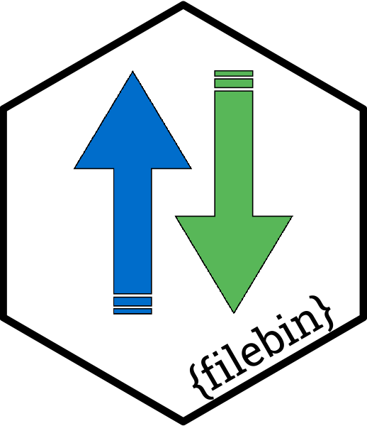

# {filebin} 

<!-- badges: start -->

[](https://cran.r-project.org/package=filebin)

[](https://app.codecov.io/github/datawookie/filebin)
[](https://lifecycle.r-lib.org/articles/stages.html)
<!-- badges: end -->

Filebin allows you to quickly & easily share files. Development of the
software behind Filebin happens here:

- <https://github.com/espebra/filebin2> (current) and
- <https://github.com/espebra/filebin> (deprecated).

This is an R wrapper for the Filebin API.

The documentation for `{filebin}` can be found
[here](https://datawookie.github.io/filebin/).

## Installation

Install the development version from GitHub as follows:

``` r
remotes::install_github("datawookie/filebin")
```

## Basic Usage

Load the package and check the versions.

``` r
library(filebin)

packageVersion("filebin")
```

    [1] '0.0.6'

Upload a file to randomly named bin on Filebin.

``` r
DESCRIPTION_PATH <- system.file("DESCRIPTION", package = "filebin")

description <- file_post(DESCRIPTION_PATH)
```

Take a look at the result.

``` r
description %>% select(filename, bin)
```

Download a file using an URL.

``` r
file_get(description$url, file = "description.txt")
```

Download a file using filename and bin.

``` r
file_get(
  description$filename,
  description$bin,
  file = "description.txt",
  overwrite = TRUE
)
```

Compare to original document.

``` r
md5sum(c(DESCRIPTION_PATH, "description.txt"))
```

## API Endpoints

File endpoints:

- [x] `GET /{bin}/{filename}`
- [x] `DELETE /{bin}/{filename}`
- [x] `POST /{bin}/{filename}`

Bin endpoints:

- [x] `GET /{bin}`
- [x] `PUT /{bin}`
- [x] `DELETE /{bin}`
- [x] `GET /qr/{bin}`
- [x] `GET /archive/{bin}/tar`
- [x] `GET /archive/{bin}/zip`
